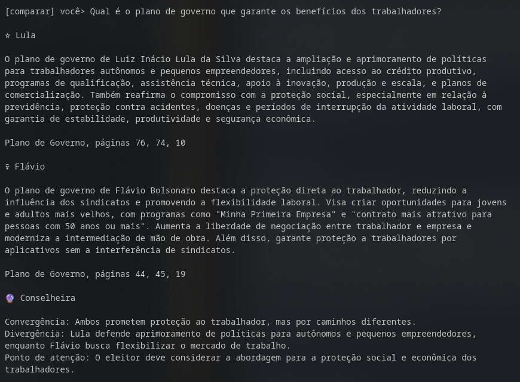
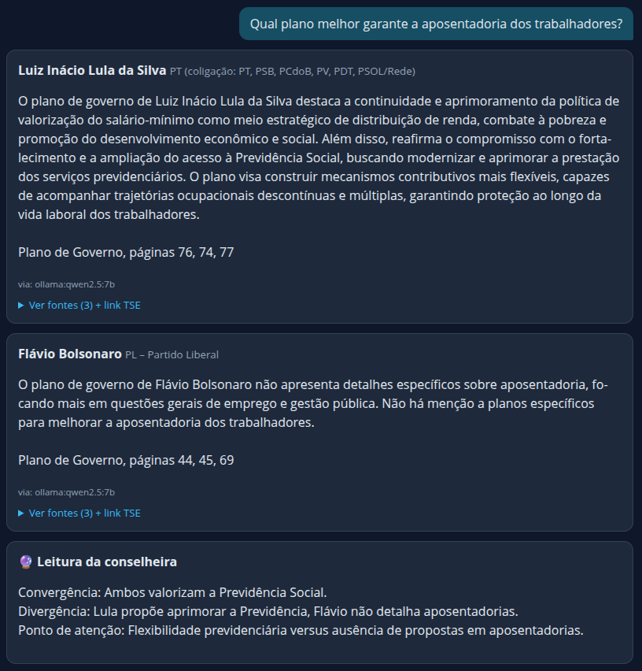

# Conselheira 2026 — Chatbot dos Planos de Governo (Presidente do Brasil)

> 🎓 **Projeto educacional, sem fins partidários e sem propaganda eleitoral.**
> Responde perguntas de eleitoras e eleitores **exclusivamente a partir dos
> planos de governo oficiais** registrados no TSE para a Eleição Presidencial 2026.
> As respostas citam páginas dos PDFs — confira sempre o documento original.

| Candidato | Partido | Páginas | Fonte oficial |
|---|---|---|---|
| Luiz Inácio Lula da Silva | PT | 84 | [Página do TSE](https://www.tse.jus.br/eleicoes/eleicoes-2026-content/propostas-de-governo-dos-candidatos-ao-cargo-de-presidente-da-republica-eleicoes-2026/lula-propostas-de-governo) |
| Flávio Bolsonaro | PL | 76 | [Página do TSE](https://www.tse.jus.br/eleicoes/eleicoes-2026-content/propostas-de-governo-dos-candidatos-ao-cargo-de-presidente-da-republica-eleicoes-2026/flavio-bolsonaro) |

Arquivos locais em `data/` (PDFs oficiais + texto extraído):

- `data/plano-lula-tse.pdf` / `data/plano-lula.txt`
- `data/plano-flavio-bolsonaro-tse.pdf` / `data/plano-flavio-bolsonaro.txt`

## Como funciona

1. **Busca local (sempre ativa, grátis, offline):** índice TF-IDF artesanal em
   `chatbot.py` encontra os trechos mais relevantes de cada plano e monta
   resposta extrativa com **citação de páginas**.
2. **🦙 Ollama local — modo recomendado (`--local`):** os trechos são enviados
   ao modelo instalado na sua máquina (ex.: `qwen2.5:7b`) para redação neutra
   com citações. **Nada sai da sua máquina.** Sem `OLLAMA_MODEL` definido, usa
   o 1º modelo instalado detectado via `/api/tags`.
3. **☁️ IA em nuvem (opcional, RAG):** se `OPENAI_API_KEY` ou
   `GEMINI_API_KEY`/`GOOGLE_API_KEY` estiver definida (e `--local` NÃO for
   usado), os trechos vão ao LLM para redação final. Sem chave, o programa
   continua funcionando no modo local. **Você precisa obter sua própria API key
   junto ao provedor.**

Recursos:

- ✅ Modo comparativo (lado a lado) + filtro por candidato
- ✅ Resposta consolidada e conclusiva (máx. 1500 caracteres, sem cortar palavras)
  + linha de fontes padronizada (`Plano de Governo, páginas 30, 28, 26`)
- ✅ Leitura da Conselheira em 3 linhas (texto puro, sem rótulos "Linha 1…")
- ✅ Sugestões de perguntas por tema (saúde, educação, segurança, economia…)
- ✅ Formatação que respeita a largura do terminal + quebra segura na web
- ✅ Histórico da conversa (terminal e web)
- ✅ Modo perfil: pergunta pessoal aberta ("sou desempregado aos 63 anos…")
  é decomposta em temas (aposentadoria, trabalho, programas sociais…) com
  resposta por dimensão e comparativo neutro — sem indicar voto

## Instalação da Conselheira

Pré-requisito: **Python 3.10+**.

```bash
git clone https://github.com/cesarbrod/conselheira.git
cd conselheira
python3 -m venv .venv && source .venv/bin/activate
pip install -r requirements.txt
cp .env.example .env   # opcional, só se for usar IA em nuvem
```

## Instalação do Ollama (LLM local — recomendado)

O modo `--local` usa o [Ollama](https://ollama.com) rodando na sua máquina.
Nenhum dado é enviado para a nuvem.

**1. Instale o Ollama** (Linux):

```bash
curl -fsSL https://ollama.com/install.sh | sh
```

Outras plataformas: baixe em [ollama.com/download](https://ollama.com/download)
(Windows, macOS).

**2. Baixe um modelo** (escolha um; o primeiro exemplo é o testado neste projeto):

```bash
ollama pull qwen2.5:7b        # ~4.7 GB — bom equilíbrio em PT-BR (recomendado)
# alternativas leves/pesadas:
ollama pull llama3.1:8b       # alternativa geral
ollama pull mistral:7b        # mais leve
ollama pull gemma2:9b         # mais pesado, exige mais RAM/VRAM
```

**3. Suba o servidor** (em geral já sobe sozinho; se preciso):

```bash
ollama serve        # em outro terminal
ollama list         # confere os modelos instalados
```

**4. Use com a Conselheira:**

```bash
source .venv/bin/activate
python terminal.py --local                        # usa o 1º modelo instalado
OLLAMA_MODEL=qwen2.5:7b python terminal.py --local  # escolhe o modelo
```

Variáveis opcionais no `.env`:

```ini
# OLLAMA_URL=http://localhost:11434
# OLLAMA_MODEL=qwen2.5:7b   # vazio = usa o 1º modelo instalado
# OLLAMA_TIMEOUT=180
```

> 💡 **Dica de hardware:** modelos `7b–8b` quantizados (Q4) rodam bem com
> 8–16 GB de RAM. Sem GPU, a primeira resposta demora alguns segundos;
> as seguintes são mais rápidas.

## Uso — terminal

```bash
source .venv/bin/activate
python terminal.py                 # interativo (modo comparar)
python terminal.py --modo lula     # só Lula
python terminal.py --sem-ia        # força busca local mesmo com chave configurada
python terminal.py --local         # usa seu Ollama local (nada vai p/ nuvem)
```

Comandos dentro do terminal: `temas` · `modo comparar|lula|flavio` · `historico` · `sair`

Exemplo (modo comparar + Ollama local):



## Uso — web (Flask)

```bash
source .venv/bin/activate
python app.py
# abra http://127.0.0.1:5000
```

Na página, marque **"Usar Ollama local"** para redação via modelo da sua máquina.

Exemplo (respostas lado a lado + leitura da conselheira):



API JSON:

- `POST /api/perguntar` → `{"pergunta": "...", "modo": "comparar|lula|flavio", "usar_ia": true}`
- `GET /api/temas` · `GET /api/historico` · `POST /api/limpar` · `GET /api/ollama`

## Usar modelos em nuvem (opcional)

Funciona sem nenhuma chave (modo local). Se preferir redação por LLM em nuvem,
**obtenha sua própria API key** no provedor e configure no `.env`:

```ini
# OpenAI (prioridade 1)
OPENAI_API_KEY=sua-chave-aqui
OPENAI_MODEL=gpt-4o-mini

# Google Gemini (prioridade 2, usado se OpenAI ausente/falhar)
GEMINI_API_KEY=sua-chave-aqui
# ou GOOGLE_API_KEY=sua-chave-aqui
GEMINI_MODEL=gemini-2.5-flash
```

Veja os nomes atuais dos modelos na documentação de cada provedor, pois podem
ser descontinuados/renomeados (o código tenta `gemini-2.5-flash` →
`gemini-2.0-flash` → `gemini-1.5-flash` automaticamente).

## Aviso educacional

Projeto **educacional**, sem propaganda eleitoral e sem juízo partidário. As
respostas são geradas **apenas** a partir dos documentos oficiais — trechos,
páginas e links do TSE acompanham cada resposta. **Confira sempre o PDF
original no portal do TSE** antes de formar sua opinião ou compartilhar.

## Histórico de alterações recentes

- **Modo perfil** — pergunta pessoal ("qual plano mais me atende?") detectada,
  decomposta em dimensões temáticas e respondida por dimensão, com conselheira
  comparativa neutra (mapeia relevância, nunca endossa; endosso cai para
  revisão local); 26 testes dourados offline em `test_chatbot.py`.
- **Temas sugeridos auditados** — 12 sugestões com veredito apurado (saúde+SUS,
  aposentadoria e idosos, salário mínimo, programas sociais, Farmácia Popular…);
  pergunta-morta ("não trata") virou divergência honesta ou foi reformulada;
  teste trava o veredito esperado de cada sugestão; 22 testes dourados
  offline em `test_chatbot.py`.
- **Equivalência de temas** — famílias morfológicas (alfabetização ↔
  alfabetizar/alfabetizada, professor ↔ docente…) valem como o mesmo tema na
  busca; termo específico ausente gera ponte honesta ("não menciona 'merenda'
  diretamente. Você gostaria de saber… para a educação?"); 21 testes dourados
  offline em `test_chatbot.py`.
- **Capitalização gramatical** — toda frase começa com maiúscula (conselheira
  e corpo das respostas), com proteção a abreviações ("p.", "ex.", "Sr.") e
  decimais; 17 testes dourados offline em `test_chatbot.py`.
- **Conselheira sem LLM quando falta conteúdo** — se qualquer lado está com
  tema NÃO ENCONTRADO, a leitura é determinística (a LLM nem é chamada), pois
  qualquer moldura "ambos convergem/divergem" vira alucinação; 14 testes
  dourados offline em `test_chatbot.py`.
- **Anti-alucinação na conselheira** — prompt com situação apurada em primeiro
  plano + exemplo de erro proibido ("Ambos mencionam…" com um lado ausente);
  validação determinística pós-LLM: convergência afirmada com vereditos
  opostos descarta a saída e usa leitura local (`via: busca-local (revisão)`);
  resposta negativa nunca sugere reformular a pergunta.
- **Sintonia da síntese (grounding)** — trava de termo-âncora na busca (palavra
  genérica como "proteção" sozinha não valida mais chunk de outro assunto);
  veredito por plano (`encontrado` / `nao_encontrado`, também na API);
  resposta negativa padronizada sem citar páginas; prompt RAG sem vazar
  mecânica interna ("trechos fornecidos") e sem plural indevido ("os planos"
  no modo individual); conselheira recebe a situação apurada como fato e é
  proibida de generalizar entre planos (vereditos opostos = divergência);
  9 testes dourados offline em `test_chatbot.py`.
- **Formatação das respostas** — terminal respeita a largura real da tela sem
  cortar palavras; cortes de texto (1500/600 chars) nunca partem palavra no
  meio; leitura da conselheira em texto puro (sem "Linha 1…"); CSS da web com
  quebra segura por palavra.
- **Documentação** — README com instalação do Ollama e modelos locais,
  exemplos com screenshots (`screenshots/terminal.png`, `screenshots/web.png`)
  e instruções para uso opcional de modelos em nuvem via API keys.
